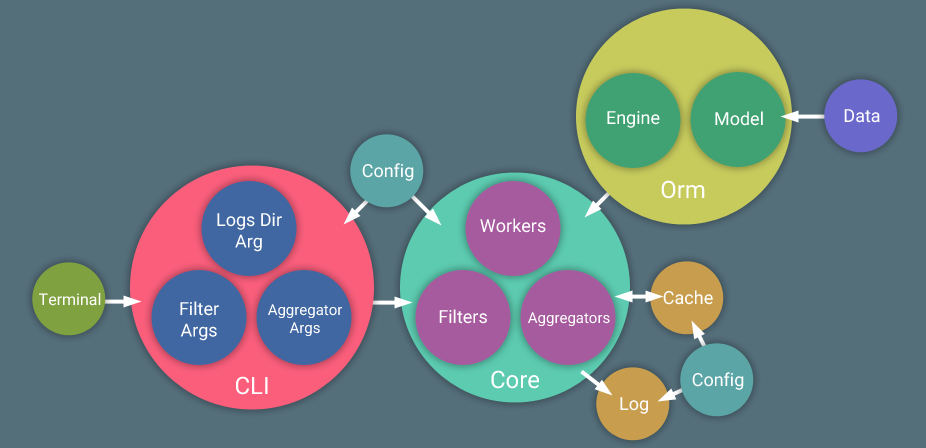

# Solution to Render Stats App
##### By Anurag Bisht
##

### Introduction
Terminal application that can be used to parse and combine data out of
csv files and provide details on the data set as a whole.

### User Documentation

#### Installation

1. Unpack the downloaded tar file.

    ```
    tar xvzf file.tar.gz
    ```
2. Change directory to parent app folder.

    ```
    cd render_stats_app
    ```

	Note, always execute the command from this directory.

#### Execution

In the parent folder locate the `run.sh` file and execute it using below command.

```
cd render_stats_app
```

Invoking of app generates byte complied and other additional files, before execution run

```
make clean-all
```

to start fresh.

#### Environment

Environment the app is tested on

* Python 2.7.13
* Ubuntu 17.04
* Os Type 64bit
* Ram 3GB
* Processor Intel Core i7-3632QM CPU @ 2.20GHz
* Core 2

#### Usage

We can obtain the successful renders by following command.

```
./run.sh
```

Output can be modified by using filter arguments.
docs
```
./run.sh --app maya --renderer renderman
```

This will get all the `successful` `renderman` renders for `maya`.

We can aggregate properties too like `maxcpu`.

```
./run.sh --maxcpu
```

It would output `maximum cpu` consumption for `successful` renders.

We can combine the filter and aggregator arguments which can lead to more flexible reasoning.

Please look up `--help` for details.

```
./run.sh --help
```

### Technical Documentation

#### Data Processing (Side View)


`Staging` architecture with `data stream` appeared to be the suitable solution for this problem. It consists of three stages `Retrieval`, `Filtering` and `Aggregation` stage with data streaming through these stages to produce the final result.

Data processes happens using following steps:

1. At `Retrieval Stage` workers fetch the data from `data stores` in a `round robin` fashion. They turn the data into `data stream` which flows through this tier to the next one.
2. `Filter Workers` start consuming the data and filter the records based on `filters objects` provided.
3. `Aggregate Workers` consumes data from filter stream and produces the final result. Aggregation happens in two stages. In first stage, operations are performed which are independent of other records. From this we obtain very few results which are dependent on each other and can be aggregated in second stage sequentially. For instance, calculating average, in first stage we can calculate the sum of all records independently and in second stage accumulate these results and sum together and finally divided by the number of records.

*This workflow is partially based on Map-Reduce model and data-stream*

##### Pros

* It's swift because workers are not waiting for data, it appears almost instantaneously.
* Data get streamed as soon as it's processed therefore, the next stage workers are always working with small size data.
* For the same reason, memory stamps remains low for the system.
* We are not making any blocking calls while accumulating a large data set or while locking against another worker or writing the data to shared memory. Therefore the process remains smooth.

##### Cons

* Difficult to debug and inspect, as all the workers are performing simultaneously, at times it could be challenging to follow the control flow.
* Possibility of missing the data, there is no way to know when a stage has finished producing the data and thus for consumer it's difficult to know when to close the connection with the data stream.

#### App Design (Top View)



Let's make sense of these multi-colour circles.

##### Terminal
is the client which would interact with the app.

##### Cli
can be considered as the entry point for the app which would parse the input arguments and fix/modify them to be better suited for the app's logic. For instance, if `--failed` is passed as an input logically it means remove the success filter and get all the results.

##### Core
contains processing components for the app. Post argument parsing, arguments get converted into `Retriever`, `Filter`, `Aggregator` objects. Core spawns multiple `Workers` to perform different operations based on above objects. `Retriever Workers` fetch `record objects` from persistent store (`csv`). `Filter Workers` operate on these record objects and apply `filters` to get the desired records and finally `Aggregator Workers` take these filtered records and aggregate the asked property.

##### Orm
To interact with persistent store we use `orm` which through it's `engine` retrieves the records from store and convert them into `model`(record) objects that `core` operates upon.

##### Additional Infrastructure
Apart from primary infrastructure defined above, we need additional supportive infrastructure to make system more efficient and able to inspect.

* `Cache` - as the records are immutable any read operations against them will always be idempotent which makes them a trivial case for caching. For instance, maya renders for a particular date will always produce the same result. We cache this data in a file on disk.
* `Logging` - log events are stored in a file, mostly added in workers to examine their behaviour.
* `Configuration` - variables that change the behaviour of a component are stored in configuration file so that we tweak the system from outside. Example would be number of workers running.

#### Directory Structure


* `root level` - At root level we have more public facing files like `run.sh` and `main.py`.
* `_impl` - contains all the implementation for the app. It's protected to keep out from external influence.
    * `core` - contains the core implementation, for instance, `workers` for concurrency.
        * `compute` - contains code for computation e.g. `filters` and `aggregators`.
        * `orm` - layer responsible for interaction with persistent store.
    * `utils` - contains different utilities required for this app to function. For instance, `cli` module for commandline.
* `_logs` - internal to the system, contains `logs` and `cache`.
* `config` - contains various configuration for the system. Public visibility so that we can tweak the system from outside.

#### Intentional Choices
I consider this as a conceptual app through which I can present the design and principles for such apps. To do it clearly I've strip down the actual implementation of the components (for instance, caching is a) and not using any third party technologies.

#### Bugs

If you see inaccurate results please dial down the `aggregator_threads` value to `1` in the `./config/__init__.py` under `Concurrency` class.
I hope you won't hit this hurdle :) .

#### Improvements
* I realised (late) that this is more `cpu` intensive task than `i/o` bound and should  have used `multiprocessing` instead of `multithreading` for concurrency.
* Speaking of concurrency, would be interesting to play with `async` stuff and compare the performance.
* May be we can run above stages as services.
